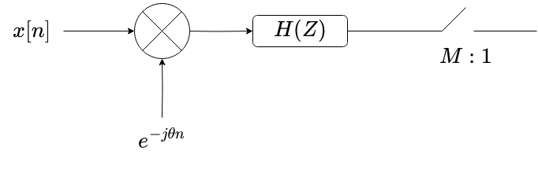
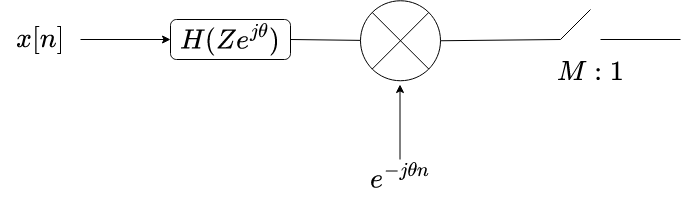

Consider the following operation on the sequence $x[n]$:

1. The frequency band of the input centered at $\theta$ is first downconverted to baseband (this is signal speak for shifting the entire frequency spectrum of $x[n]$ to the left by $\theta$). 

2. Then, the downconverted input is passed through a filter $H(Z)$ a notation which simply represents
$$H(Z) = \sum_{n=0}^\infty h_n z^{-n}.$$ 

In this notation, we multiply the z-transform of $x[n]$ by $H(Z)$ which in time domain simply implies convolution of $x[n]$ by the filter coefficients $h_n$.

3. Finally, the output of the filter is downsampled/subsampled by a factor of $M$. This is signalspeak for only keeping every $M$-th element in the input. Note that the filter is needed, otherwise, a naive subsampling causes aliasing effects in the spectral domain.

This downconvert, filter and then subsample pattern is routinely performed in the case of analyzing isolated frequency bands of the input signals. Therefore, it is of utmost improtance that this be done quickly. We explore the technique of polyphase decomposition of $H(Z)$ to do this.

We first note the following:
$$\sum_{k=-\infty}^\infty x[k]e^{-j\theta k} h_{n-k} = e^{-j\theta n}\sum_{k}x[k] h_{n-k}e^{j\theta(n-k)}$$

This is as if, the filter coefficients $h_n$ have been replaced by $h_n e^{j\theta n}$. This implies the following rearrangement of the block diagram above\

A result that is known as the equivalence theorem.
