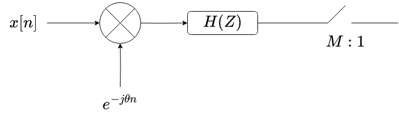

This is a Rust implementation of the polyphase channelizer.
Consider the following operation being performed on an input data stream $x[n]$.
The input stream is first downconverted to a frequency $\theta$, passed through a filter $H(Z)$ denotes the z-transform of the filter, which is the quantity 
$H(Z) = \sum_{n}$.